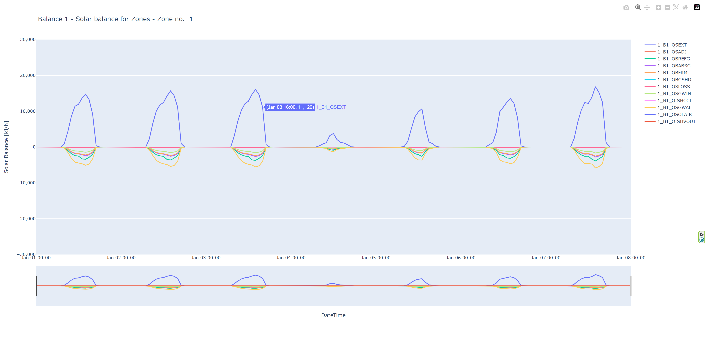

# TRNSYS Type56 Balance Ouputs
Balance outputのデータをPlotlyで描画するサンプル

Examples of Plotting Balance output data in Plotly

## Balance output and output file 

| Balance | balance file |
| ---- | ---- |
| BALANCE 1 – SOLAR BALANCE FOR ZONES (NTYPE 901) | SOLAR_ZONES.BAL
| BALANCE 2 – SOLAR BALANCE FOR SUM OF ALL ZONES (NTYPE 902) | SOLAR_TOT.BAL
| BALANCE 3 – SOLAR BALANCE FOR EXTERNAL WINDOW (NTYPE 903) | SOLAR_WIN_XXX.BAL
| BALANCE 4 – SENSIBLE ENERGY BALANCE OF ZONES (NTYPE 904) | Energy_zone.BAL
| BALANCE 5 – SENSIBLE ENERGY BALANCE: SUM OF ALL ZONES (NTYPE 905) | ENERGY_TOT.BAL   
| BALANCE 6 – ENERGY BALANCE FOR SURFACES (NTYPE 906) | ENERGY_SURF_XXX.BAL
| BALANCE 7 – MOISTURE BALANCE FOR ZONES (NTYPE 907) | MOISTURE_Zone.BAL
| BALANCE 8 – MOISTURE BALANCE FOR SUM OF ALL ZONES (NTYPE 908) | MOISTURE_TOT.BAL
| BALANCE 9 – SUMMARY | SUMMARY.BAL


## Balance output and output files, scripts, HTML files

| Balance | Balance file | Script | html file |
| ---- | ---- | ---- | ---- |
| BALANCE 1 | SOLAR_ZONES.BAL   | plot_balance1.py | balance1_solar_zones- Zone no. {selected_zone}.html
| BALANCE 2 | SOLAR_TOT.BAL     | plot_balance2.py | balance2_solar_tot.html
| BALANCE 3 | SOLAR_WIN nnn.BAL | plot_balance3.py | balance3_solar_win{surface_number: >5}.html
| BALANCE 4 | Energy_zone.BAL   | plot_balance4.py | balance4_energy_zone - Zone no. {selected_group_name}.html
| BALANCE 5 | ENERGY_TOT.BAL    | plot_balance5.py | balance5_energy_tot.html
| BALANCE 6 | ENERGY_SURF_nnnn.BAL | plot_balance6.py | balance6_energy_surf_{surface_number:04d}.html
| BALANCE 7 | MOISTURE_Zone.BAL | plot_balance7.py | balance7_moisture_zone - Zone no. {selected_group_name}.html
| BALANCE 8 | MOISTURE_TOT.BAL  | plot_balance8.py | balance8_moisture_tot.html
| BALANCE 9 | SUMMARY.BAL       | plot_balance9.py | balance9_summary.html

# How to use the script

## Install

スクリプトの実行にはPandas,Plotlyが必要です。予めインストールしておいて下さい。

Pandas and Plotly are required to run the script. Please install them beforehand.

```
pip install pandas
pip install plotly
```


## How to run the script
例）balance 1

デフォルトではスクリプトを配置したフォルダに"Project"フォルダのOutput fileを参照しています。例えば、plot_balance1.pyを実行すると'.\Project\SOLAR_ZONES.BAL'を読み込んでHTML形式のチャート生成します。

スクリプトを起動すると、プロットするZoneの入力を求められます。Blance 1では.b18に含まれるすべてのZoneのエネルギーバランスが出力されています。その中からプロットしたいZoneを選んでください。

以下は、1番目のZoneを選択した例。

By default, the folder where the script is placed refers to the Output file in the "Project" folder. For example, if you run plot_balance1.py, it will read '. \Project.SOLAR_ZONES.BAL.BAL' and generates a chart in HTML format.

When you run the script, you will be asked to enter the Zones you want to plot, and Blance 1 will output the energy balances for all the Zones in .b18. Select the Zone you wish to plot.

Below is an example of selecting the first Zone.

```
C:\lab\Python\Balance outputs>python plot_balance1.py
Please select a group to plot:
1. Zone no. 1
2. Zone no. 2
1

C:\WorkCopy\lab\Python\Balance outputs>
```
<p align="center">
  
</p>


## 
スクリプトの先頭に以下のような定数を定義しています。この定数で参照するOutput file(.bal)や保存先のHTMLファイルのパスを変更する事ができます。使用者の環境に合せて適宜修正して使用してください。

The following constants are defined at the beginning of the script. These constants allow you to change the balance file (.bal) referenced, the path to save the HTML file, and so on. Please modify them according to your environment.


```python
FILE_PATH = r'.\Project\SOLAR_ZONES.BAL'  # File path to read
OUTPUT_PATH = 'balance1_solar_zones- Zone no. {selected_zone}.html'  # html file path to save
FIGURE_TITLE = 'Balance 1 - Solar balance for Zones - Zone no.  {selected_zone}' # Figure title, e.g. 'Energy balance for surface - surface no.0001'
Y_AXIS_RANGE = [-30000, 30000] # Y-axis range, e.g. [-30000, 30000]
Y_AXIS_TITLE = 'Solar Balance [kJ/h]' # Y-axis title, e.g. 'Energy [kWh]'
PLOT_START_TIME = 0 # Plot start time [h], e.g. 0
DATETIME_ORIGIN = '2021-01-01' # Calendar start date other than leap years, e.g. '2021-01-01'
```


# 動作環境

以下の環境で動作を確認しています

* Windows11 Pro(64bit, 22H2)
* TRNSYS18.05.0001(64bit)
* Pyhton 3.11.4
* pandas 2.1.1
* plotly 5.17.0